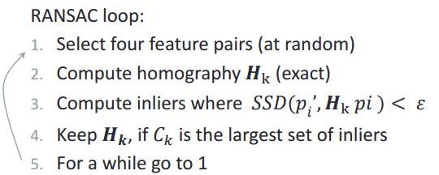
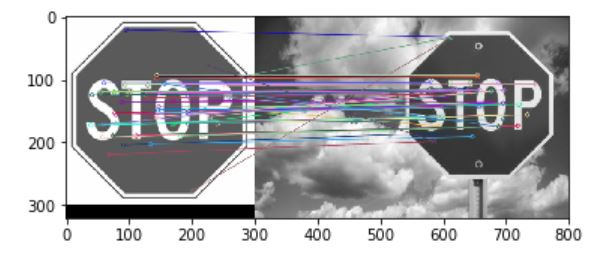
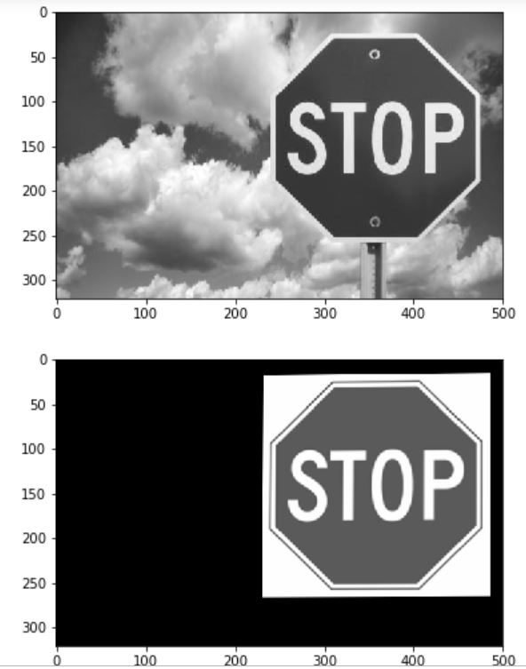

# Understanding RANSAC for estimating the homography matrix between pairs of points (matches)

- we need at least 3 point pairs (matches) to calculate an affine transformation
- we need at least 4 point pairs (matches) to calculate a perspective transformation

we can use [RANSAC](https://en.wikipedia.org/wiki/Random_sample_consensus) to calculate the homography matrix between matches.

### Testing

we used surf to detect matches, then we pass these matches to apply_ransac function.
- detecting matches by surf:

- getting the homography matrix from apply_ransac function and transform image 1.jpg to 2.jpg:

### Prerequisites
`pip install numpy`

`pip install opencv-python` (v3.4)

`pip install matplotlib`
